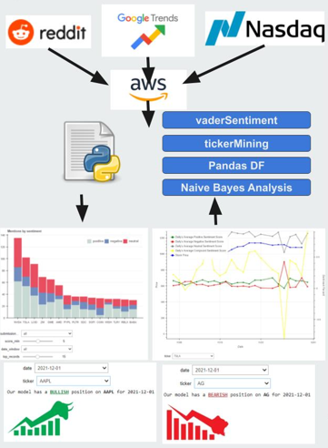

# House Address Classifier

## Introduction

The objective of the project will be to develop a system that is able to predict rising or falling stock prices based on Natural Language Processing. The team gathered data from multiple Reddit threads, Google trend data, and data from the NASDAQ in order to design our system.

## Our Implementation
1. Multiple Reddit communities, Google Trends, & NASDAQ are scraped to get data
2. Text data us cikkected from Reddut submissions and stored with metadata as CSV files
3. Each submission is cleaned by removing emoji, pirctures, and common Reddit slang
4. Stock tickers from the NASDAQ are used to identify stocks with each submission
5. Sentiment is given positive, neutral, negative, and compound score using VADER
6. A time series analysis is performed on the sentiment with a Naive Bayes machine learning model
7. The data is represented by 3 visualizations
8. Traders are able to tailor the sentiment analysis to best fit their trading strategy

  
  

## Results
The team was able to achieve a 84% accuracy on our developed stock ticker identifier, a 57% accuracy on the Naive Bayes machine learning model Bearish/Bullish predictions, and a 8/10 for ease of use of our visualizations.

 

To see a full video on the results of the project, visit:
https://youtu.be/KgzmUvG1BAE